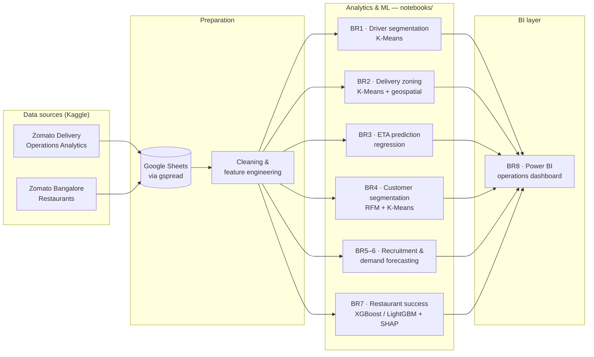

# Zomato Transport BI


> **EN —** A Business Intelligence solution for a food‑delivery / transport operator
> (**Zomato**). It turns delivery‑operations and restaurant data into actionable insight
> across eight business requirements — driver segmentation, delivery zoning, ETA
> prediction, customer segmentation, recruitment and demand forecasting, restaurant
> success scoring, and a real‑time operations dashboard.
>
> **VI —** Giải pháp Trí tuệ Kinh doanh (BI) cho một đơn vị hoạt động trong lĩnh vực
> vận tải / giao nhận đồ ăn (**Zomato**). Dự án khai thác dữ liệu vận hành giao hàng và
> nhà hàng để hỗ trợ ra quyết định trên tám yêu cầu nghiệp vụ — phân nhóm tài xế, phân
> vùng giao hàng, dự đoán thời gian giao hàng, phân khúc khách hàng, tối ưu tuyển dụng &
> dự báo nhu cầu, dự đoán mức độ thành công của nhà hàng, và dashboard giám sát vận hành
> theo thời gian thực.

---

## Bối cảnh / Context

Zomato hoạt động trong thị trường giao nhận đồ ăn cạnh tranh cao, chịu áp lực về chi phí
vận hành và trải nghiệm khách hàng. Quy trình vận hành gồm 4 bước: khách đặt hàng → nhà
hàng xử lý đơn → hệ thống phân bổ tài xế → giao hàng và đánh giá. Dự án áp dụng các kỹ
thuật khai phá dữ liệu và BI vào từng mắt xích của quy trình này nhằm:

- Tối ưu hóa vận hành và giảm chi phí.
- Cải thiện trải nghiệm khách hàng, tăng độ trung thành.
- Hỗ trợ ra quyết định chiến lược dựa trên dữ liệu.
- Gia tăng doanh thu và tạo lợi thế cạnh tranh.

## Architecture



## Business requirements / Yêu cầu nghiệp vụ

| # | Notebook / Artifact | Business requirement (VI) | What it does (EN) | Technique |
|---|---------------------|---------------------------|-------------------|-----------|
| **BR1** | [`notebooks/br1-driver-segmentation.ipynb`](notebooks/br1-driver-segmentation.ipynb) | Phân nhóm tài xế | Segment drivers by performance to support rewards and fair order allocation | K‑Means clustering |
| **BR2** | [`notebooks/br2-delivery-zoning.ipynb`](notebooks/br2-delivery-zoning.ipynb) | Phân vùng giao hàng | Cluster delivery locations into operating zones to shorten routes | K‑Means + Folium maps |
| **BR3** | [`notebooks/br3-delivery-time-prediction.ipynb`](notebooks/br3-delivery-time-prediction.ipynb) | Dự đoán thời gian giao hàng | Predict delivery time from weather, traffic and vehicle factors | Regression |
| **BR4** | [`notebooks/br4-customer-segmentation.ipynb`](notebooks/br4-customer-segmentation.ipynb) | Phân khúc khách hàng | Segment customers by ordering behaviour for personalization | RFM + K‑Means |
| **BR5–6** | [`notebooks/br5-6-recruitment-and-demand-forecasting.ipynb`](notebooks/br5-6-recruitment-and-demand-forecasting.ipynb) | Tối ưu tuyển dụng & Dự báo nhu cầu | Optimize driver recruitment and forecast purchasing / order demand | Classification + forecasting |
| **BR7** | [`notebooks/br7-restaurant-success-prediction.ipynb`](notebooks/br7-restaurant-success-prediction.ipynb) | Dự đoán sự thành công của nhà hàng | Score restaurant success to set quality standards | XGBoost / LightGBM + SHAP |
| **BR8** | [`dashboard/zomato-bi-dashboard.pbix`](dashboard/zomato-bi-dashboard.pbix) | Giám sát vận hành giao hàng | Real‑time operations monitoring dashboard | Power BI |

Per‑requirement result exports (PDF) are in [`results/`](results/).

## Repository structure

```
.
├── notebooks/                 # Source analysis & ML notebooks (one per BR)
│   ├── br1-driver-segmentation.ipynb
│   ├── br2-delivery-zoning.ipynb
│   ├── br3-delivery-time-prediction.ipynb
│   ├── br4-customer-segmentation.ipynb
│   ├── br5-6-recruitment-and-demand-forecasting.ipynb
│   └── br7-restaurant-success-prediction.ipynb
├── dashboard/
│   └── zomato-bi-dashboard.pbix          # BR8 — Power BI operations dashboard
├── results/                              # Rendered notebook outputs (PDF), one per BR
├── docs/
│   ├── business-requirements.md          # The 8 business requirements in detail
│   ├── data-dictionary.md                # Datasets & field-level reference
│   ├── report.pdf                        # Full written report (VI)
│   └── presentation.pdf                  # Slide deck (VI)
├── requirements.txt                      # Python dependencies for the notebooks
├── LICENSE
└── README.md
```

## Data sources

Two public datasets from Kaggle:

| Dataset | Author | Used by |
|---------|--------|---------|
| Zomato Delivery Operations Analytics Dataset | Saurabh Badole | BR1, BR2, BR3, BR5–6 |
| Zomato Bangalore Restaurants | Himanshu Poddar | BR4, BR7 |

See [`docs/data-dictionary.md`](docs/data-dictionary.md) for the field‑level reference.

## Tech stack

- **Language:** Python 3 (Jupyter / Google Colab)
- **Data & ML:** pandas, NumPy, scikit‑learn, XGBoost, LightGBM, SHAP, kneed
- **Geospatial:** Folium, geopy, branca
- **Visualization:** Matplotlib, seaborn, Plotly
- **Data access:** gspread / gspread‑dataframe (Google Sheets), oauth2client
- **BI:** Microsoft Power BI (`.pbix`)

## Getting started

```bash
# 1. (optional) create a virtual environment
python -m venv .venv && source .venv/bin/activate

# 2. install dependencies
pip install -r requirements.txt

# 3. open the notebooks
jupyter lab notebooks/
```

The notebooks were originally run on Google Colab and load data through Google Sheets
(`gspread`). To run locally, download the two Kaggle datasets above and point the data‑load
cells at your local copies (or your own Google Sheet). Open
[`dashboard/zomato-bi-dashboard.pbix`](dashboard/zomato-bi-dashboard.pbix) with Power BI
Desktop.

## Deliverables

- 📄 **Report (VI):** [`docs/report.pdf`](docs/report.pdf)
- 📊 **Slides (VI):** [`docs/presentation.pdf`](docs/presentation.pdf)

## Authors

**Group 8 — Business Intelligence (CO5235), Semester II 2024–2025**
Ho Chi Minh City University of Technology (HCMUT), VNU‑HCM.
Instructor: Assoc. Prof. Dr. Võ Thị Ngọc Châu.

| Student ID | Name |
|------------|------|
| 2470717 | Võ Phạm Hoài Nam |
| 2470563 | Lê Văn Cường |
| 2470068 | Nguyễn Đinh Nhật Quang |
| 2470066 | Trần Tiến Dũng |

## License

Released under the [MIT License](LICENSE).
